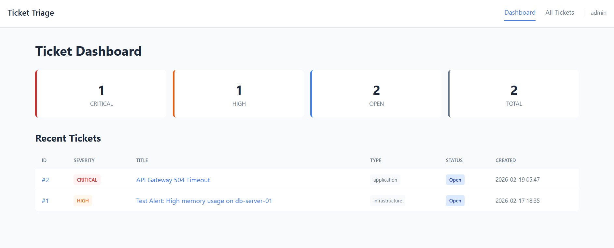
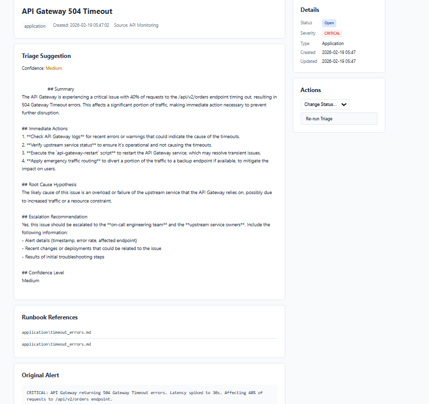

# Ticket Triage System

An AI-powered production issues ticket triage system that automatically analyzes alerts, searches runbooks, and provides actionable suggestions for incident response.

## Features

- **Intelligent Alert Classification** - Automatically categorizes alerts by type (infrastructure, application, monitoring) and severity
- **Semantic Runbook Search** - Uses vector embeddings to find relevant runbook sections
- **AI-Powered Triage Suggestions** - Generates immediate actions, root cause hypotheses, and escalation recommendations
- **Multiple Interfaces** - Web dashboard, REST API, CLI tool, and Webex integration
- **Ticket Management** - Track, update, and resolve incidents with full audit history

## Screenshots

### Dashboard Overview

*Main dashboard showing ticket statistics and recent tickets with severity indicators*

### Ticket Detail with AI Triage Suggestion

*Ticket detail view showing AI-generated triage suggestion with immediate actions, root cause hypothesis, and escalation recommendations*

## Architecture

```
┌─────────────────────────────────────────────────────────────────────────────┐
│                              TICKET TRIAGE SYSTEM                           │
└─────────────────────────────────────────────────────────────────────────────┘

┌──────────────┐    ┌──────────────┐    ┌──────────────┐    ┌──────────────┐
│    Webex     │    │     CLI      │    │  Dashboard   │    │   REST API   │
│   Webhook    │    │    Tool      │    │    (Web)     │    │   Clients    │
└──────┬───────┘    └──────┬───────┘    └──────┬───────┘    └──────┬───────┘
       │                   │                   │                   │
       └───────────────────┴─────────┬─────────┴───────────────────┘
                                     │
                                     ▼
                    ┌────────────────────────────────┐
                    │         FastAPI Server         │
                    │      (app/main.py)             │
                    └────────────────┬───────────────┘
                                     │
                    ┌────────────────┴───────────────┐
                    │                                │
                    ▼                                ▼
       ┌────────────────────────┐      ┌────────────────────────┐
       │    Triage Service      │      │    Ticket Repository   │
       │ (app/services/)        │      │    (db/repository.py)  │
       └───────────┬────────────┘      └───────────┬────────────┘
                   │                               │
       ┌───────────┴───────────┐                   │
       │                       │                   │
       ▼                       ▼                   ▼
┌─────────────┐      ┌─────────────┐      ┌─────────────┐
│  Knowledge  │      │     LLM     │      │   SQLite    │
│    Base     │      │   Service   │      │  Database   │
│  (ChromaDB) │      │ (llm/)      │      │  (data/)    │
└─────────────┘      └─────────────┘      └─────────────┘
       │
       ▼
┌─────────────┐
│  Runbooks   │
│ (Markdown)  │
└─────────────┘
```

### Component Overview

| Component | Description | Location |
|-----------|-------------|----------|
| **FastAPI Server** | Main application server with REST API and web dashboard | `app/main.py` |
| **Triage Service** | Core orchestration - classification, search, suggestion generation | `app/services/triage_service.py` |
| **Knowledge Base** | Vector store for semantic search over runbooks | `knowledge_base/` |
| **LLM Service** | AI model integration for classification and suggestions | `llm/` |
| **Ticket Repository** | CRUD operations for ticket management | `db/repository.py` |
| **Webex Service** | Webhook handling and message sending | `app/services/webex_service.py` |

### Data Flow Diagram

```
┌─────────────────────────────────────────────────────────────────────────────────────┐
│                                    DATA FLOW                                        │
└─────────────────────────────────────────────────────────────────────────────────────┘

  ┌─────────────┐     ┌─────────────┐     ┌─────────────┐
  │   Webex     │     │    CLI      │     │  REST API   │
  │   Alert     │     │   Input     │     │   Request   │
  └──────┬──────┘     └──────┬──────┘     └──────┬──────┘
         │                   │                   │
         └───────────────────┼───────────────────┘
                             │
                             ▼
         ┌───────────────────────────────────────┐
         │         1. RECEIVE ALERT              │
         │    Parse raw alert message            │
         └───────────────────┬───────────────────┘
                             │
                             ▼
         ┌───────────────────────────────────────┐
         │         2. CLASSIFY ALERT             │
         │                                       │
         │   ┌─────────────────────────────┐     │
         │   │           LLM               │     │
         │   │  • Extract title            │     │
         │   │  • Determine severity       │     │
         │   │  • Identify alert type      │     │
         │   │  • Find affected component  │     │
         │   └─────────────────────────────┘     │
         └───────────────────┬───────────────────┘
                             │
                             ▼
         ┌───────────────────────────────────────┐
         │       3. SEARCH KNOWLEDGE BASE        │
         │                                       │
         │   ┌─────────────────────────────┐     │
         │   │    Sentence Transformers    │     │
         │   │    Generate query embedding │     │
         │   └──────────────┬──────────────┘     │
         │                  │                    │
         │                  ▼                    │
         │   ┌─────────────────────────────┐     │
         │   │         ChromaDB            │     │
         │   │   Semantic similarity search│     │
         │   │   Return top N runbook      │     │
         │   │   sections with scores      │     │
         │   └─────────────────────────────┘     │
         └───────────────────┬───────────────────┘
                             │
                             ▼
         ┌───────────────────────────────────────┐
         │     4. GENERATE TRIAGE SUGGESTION     │
         │                                       │
         │   ┌─────────────────────────────┐     │
         │   │           LLM               │     │
         │   │                             │     │
         │   │  Input:                     │     │
         │   │  • Alert details            │     │
         │   │  • Relevant runbook content │     │
         │   │                             │     │
         │   │  Output:                    │     │
         │   │  • Summary                  │     │
         │   │  • Immediate actions        │     │
         │   │  • Root cause hypothesis    │     │
         │   │  • Escalation recommendation│     │
         │   │  • Confidence level         │     │
         │   └─────────────────────────────┘     │
         └───────────────────┬───────────────────┘
                             │
                             ▼
         ┌───────────────────────────────────────┐
         │         5. CREATE TICKET              │
         │                                       │
         │   ┌─────────────────────────────┐     │
         │   │         SQLite DB           │     │
         │   │  Store:                     │     │
         │   │  • Ticket details           │     │
         │   │  • Classification           │     │
         │   │  • Triage suggestion        │     │
         │   │  • Runbook sources          │     │
         │   │  • Timestamps               │     │
         │   └─────────────────────────────┘     │
         └───────────────────┬───────────────────┘
                             │
                             ▼
         ┌───────────────────────────────────────┐
         │         6. RESPOND / DISPLAY          │
         └───────────────────┬───────────────────┘
                             │
         ┌───────────────────┼───────────────────┐
         │                   │                   │
         ▼                   ▼                   ▼
  ┌─────────────┐     ┌─────────────┐     ┌─────────────┐
  │   Webex     │     │    CLI      │     │  Dashboard  │
  │   Reply     │     │   Output    │     │   Display   │
  └─────────────┘     └─────────────┘     └─────────────┘
```

### Data Flow Steps

| Step | Action | Components Used |
|------|--------|-----------------|
| 1 | **Receive Alert** | Webhook endpoint, CLI, or REST API |
| 2 | **Classify Alert** | LLM extracts type, severity, title |
| 3 | **Search Runbooks** | Embeddings → ChromaDB similarity search |
| 4 | **Generate Suggestion** | LLM with alert + runbook context |
| 5 | **Create Ticket** | SQLite database storage |
| 6 | **Respond** | Webex reply, CLI output, or dashboard |

## Project Structure

```
Ticket_triage_v1/
├── app/                          # FastAPI application
│   ├── main.py                   # Application entry point
│   ├── api/                      # API endpoints
│   │   ├── webhooks.py           # Webex webhook handler
│   │   ├── tickets.py            # Ticket CRUD API
│   │   └── health.py             # Health check endpoints
│   ├── core/
│   │   └── security.py           # Authentication (Basic Auth)
│   ├── models/                   # Pydantic schemas
│   │   ├── ticket.py             # Ticket request/response models
│   │   └── webhook.py            # Webex payload models
│   ├── services/
│   │   ├── triage_service.py     # Core triage logic
│   │   └── webex_service.py      # Webex API client
│   ├── templates/                # Jinja2 HTML templates
│   │   ├── base.html
│   │   ├── dashboard.html
│   │   ├── ticket_detail.html
│   │   └── tickets_list.html
│   └── static/css/               # Stylesheets
│
├── db/                           # Database layer
│   ├── models.py                 # SQLAlchemy ORM models
│   ├── database.py               # Connection management
│   └── repository.py             # Data access layer
│
├── knowledge_base/               # Runbook indexing
│   ├── indexer.py                # Embedding & indexing pipeline
│   ├── vector_store.py           # ChromaDB operations
│   ├── chunker.py                # Markdown document chunking
│   └── runbooks/                 # Markdown runbook files
│       ├── infrastructure/
│       ├── application/
│       └── monitoring/
│
├── llm/                          # LLM integration
│   ├── groq_client.py            # LLM API client
│   └── prompts.py                # Prompt templates
│
├── cli/                          # Command-line interface
│   └── main.py                   # CLI commands
│
├── scripts/
│   └── setup.py                  # First-time setup script
│
├── data/                         # Runtime data (gitignored)
│   ├── tickets.db                # SQLite database
│   └── chroma_db/                # Vector store
│
├── .env                          # Configuration (gitignored)
├── .env.example                  # Configuration template
├── requirements.txt              # Python dependencies
└── README.md                     # This file
```

## Installation

### Prerequisites

- Python 3.10 or higher
- pip (Python package manager)

### Setup

1. **Clone or navigate to the project directory**
   ```bash
   cd Ticket_triage_v1
   ```

2. **Create a virtual environment (recommended)**
   ```bash
   python -m venv venv

   # Windows
   venv\Scripts\activate

   # Linux/Mac
   source venv/bin/activate
   ```

3. **Install dependencies**
   ```bash
   pip install -r requirements.txt
   ```

4. **Configure environment variables**
   ```bash
   # Copy the example configuration
   cp .env.example .env

   # Edit .env with your settings
   # Required: LLM API key
   # Optional: Webex tokens, dashboard password
   ```

5. **Run the setup script**
   ```bash
   python scripts/setup.py
   ```

   This will:
   - Initialize the SQLite database
   - Index the sample runbooks into the vector store
   - Verify your configuration

## Usage

### Starting the Server

```bash
# Start on default port 8080
python -m cli.main serve --port 8080

# With auto-reload for development
python -m cli.main serve --port 8080 --reload
```

Access the dashboard at: **http://localhost:8080/dashboard**

Default credentials:
- Username: `admin`
- Password: `changeme` (change in `.env`)

### CLI Commands

```bash
# Search runbooks for relevant information
python -m cli.main query "database connection timeout"

# Generate triage suggestion AND create a ticket
python -m cli.main suggest "CRITICAL: Server disk full at 95%"

# Generate triage suggestion WITHOUT creating a ticket
python -m cli.main suggest "CRITICAL: Server disk full at 95%" --no-ticket

# List all tickets
python -m cli.main tickets

# Filter tickets by status or severity
python -m cli.main tickets --status open --severity critical

# View a specific ticket
python -m cli.main show 1

# View ticket statistics
python -m cli.main stats

# Re-index runbooks after adding new ones
python -m cli.main index

# Force full re-index
python -m cli.main index --force
```

### REST API

The API documentation is available at **http://localhost:8080/docs** (Swagger UI)

#### Key Endpoints

| Method | Endpoint | Description |
|--------|----------|-------------|
| `GET` | `/health` | Health check |
| `GET` | `/api/tickets` | List tickets |
| `GET` | `/api/tickets/{id}` | Get ticket details |
| `POST` | `/api/tickets` | Create ticket manually |
| `PATCH` | `/api/tickets/{id}` | Update ticket |
| `POST` | `/api/tickets/{id}/triage` | Re-run triage |
| `GET` | `/api/tickets/stats` | Get statistics |
| `POST` | `/webhooks/webex` | Webex webhook endpoint |

#### Example: Create a ticket via API

```bash
curl -X POST http://localhost:8080/api/tickets \
  -H "Content-Type: application/json" \
  -d '{
    "title": "High CPU on web-server-01",
    "description": "CPU usage at 95%",
    "raw_message": "ALERT: web-server-01 CPU 95%",
    "severity": "high",
    "alert_type": "infrastructure"
  }'
```

### Webex Integration

1. **Create a Webex Bot** at https://developer.webex.com/my-apps

2. **Configure tokens in `.env`**
   ```bash
   WEBEX_ACCESS_TOKEN=your_access_token
   WEBEX_BOT_TOKEN=your_bot_token
   WEBEX_WEBHOOK_SECRET=your_webhook_secret
   WEBHOOK_BASE_URL=https://your-public-url.com
   ```

3. **Expose your server publicly** (for development, use ngrok)
   ```bash
   ngrok http 8080
   ```

4. **Register the webhook** with Webex pointing to:
   ```
   https://your-ngrok-url/webhooks/webex
   ```

5. **Send alerts to the Webex space** - the bot will automatically:
   - Create a ticket
   - Generate triage suggestions
   - Reply with recommendations

## Adding Runbooks

Runbooks are markdown files that contain your incident response procedures.

### Structure

Place runbooks in `knowledge_base/runbooks/` organized by type:

```
knowledge_base/runbooks/
├── infrastructure/        # Server, network, disk, memory issues
│   ├── disk_full.md
│   ├── high_cpu.md
│   └── memory_issues.md
├── application/          # HTTP errors, timeouts, crashes
│   ├── error_500.md
│   ├── database_connection.md
│   └── timeout_errors.md
└── monitoring/           # Alert configurations, escalation
    ├── alert_thresholds.md
    └── escalation_procedures.md
```

### Runbook Format

```markdown
# Issue Title Runbook

## Overview
Brief description of the issue this runbook addresses.

## Alert Patterns
- "Error message pattern 1"
- "Error message pattern 2"

## Severity Classification
- **Critical**: When to classify as critical
- **High**: When to classify as high
- **Medium**: When to classify as medium

## Immediate Actions

### Step 1: Verify the Issue
```bash
# Commands to run
command --flags
```

### Step 2: Mitigation
1. First action
2. Second action

## Root Cause Analysis
- Common causes
- Investigation steps

## Escalation Criteria
- When to escalate
- Who to contact

## Prevention
- Long-term fixes
- Monitoring recommendations
```

### Re-indexing

After adding or modifying runbooks, re-index:

```bash
python -m cli.main index --force
```

## Configuration Reference

### Environment Variables

| Variable | Description | Default |
|----------|-------------|---------|
| `LLM_API_KEY` | API key for LLM service | Required |
| `LLM_MODEL` | Model name to use | `llama-3.3-70b-versatile` |
| `LLM_TEMPERATURE` | Generation temperature (0-1) | `0.3` |
| `DATABASE_URL` | SQLite database path | `sqlite:///data/tickets.db` |
| `DASHBOARD_USERNAME` | Dashboard login username | `admin` |
| `DASHBOARD_PASSWORD` | Dashboard login password | `changeme` |
| `WEBEX_ACCESS_TOKEN` | Webex API access token | Optional |
| `WEBEX_BOT_TOKEN` | Webex bot token | Optional |
| `WEBEX_WEBHOOK_SECRET` | Webhook signature secret | Optional |
| `EMBEDDING_MODEL` | Sentence transformer model | `all-MiniLM-L6-v2` |
| `SEARCH_RESULTS_LIMIT` | Max runbook results | `5` |
| `MIN_SIMILARITY_SCORE` | Minimum search relevance | `0.5` |

## Troubleshooting

### Common Issues

**"No relevant runbook sections found"**
- Ensure runbooks are indexed: `python -m cli.main index`
- Check that runbooks contain relevant keywords
- Lower `MIN_SIMILARITY_SCORE` in `.env`

**"LLM API error"**
- Verify your API key is correct in `.env`
- Check your API quota/rate limits
- Ensure network connectivity

**"Database locked"**
- Stop any other processes using the database
- Delete `data/tickets.db` and run setup again

**Dashboard returns 401 Unauthorized**
- Enter credentials when prompted
- Check `DASHBOARD_USERNAME` and `DASHBOARD_PASSWORD` in `.env`

### Logs

Server logs are printed to stdout. For more verbose output:

```bash
# Set debug mode in .env
DEBUG=true
LOG_LEVEL=DEBUG
```

## Development

### Running Tests

```bash
pytest
```

### Project Dependencies

- **FastAPI** - Web framework
- **SQLAlchemy** - Database ORM
- **ChromaDB** - Vector database
- **Sentence Transformers** - Text embeddings
- **Typer** - CLI framework
- **Rich** - Terminal formatting
- **Jinja2** - HTML templating
- **httpx** - HTTP client for Webex

## License

This project is for internal use.

## Support

For issues or questions, contact your development team or create an issue in the project repository.
